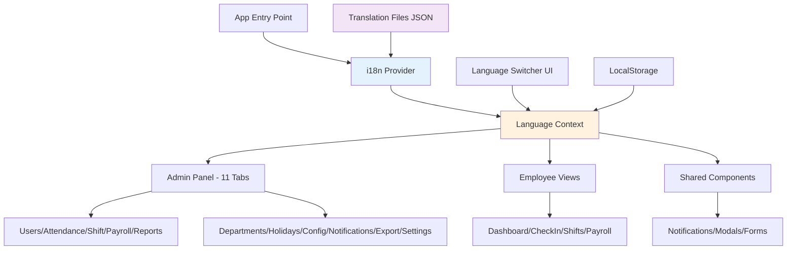
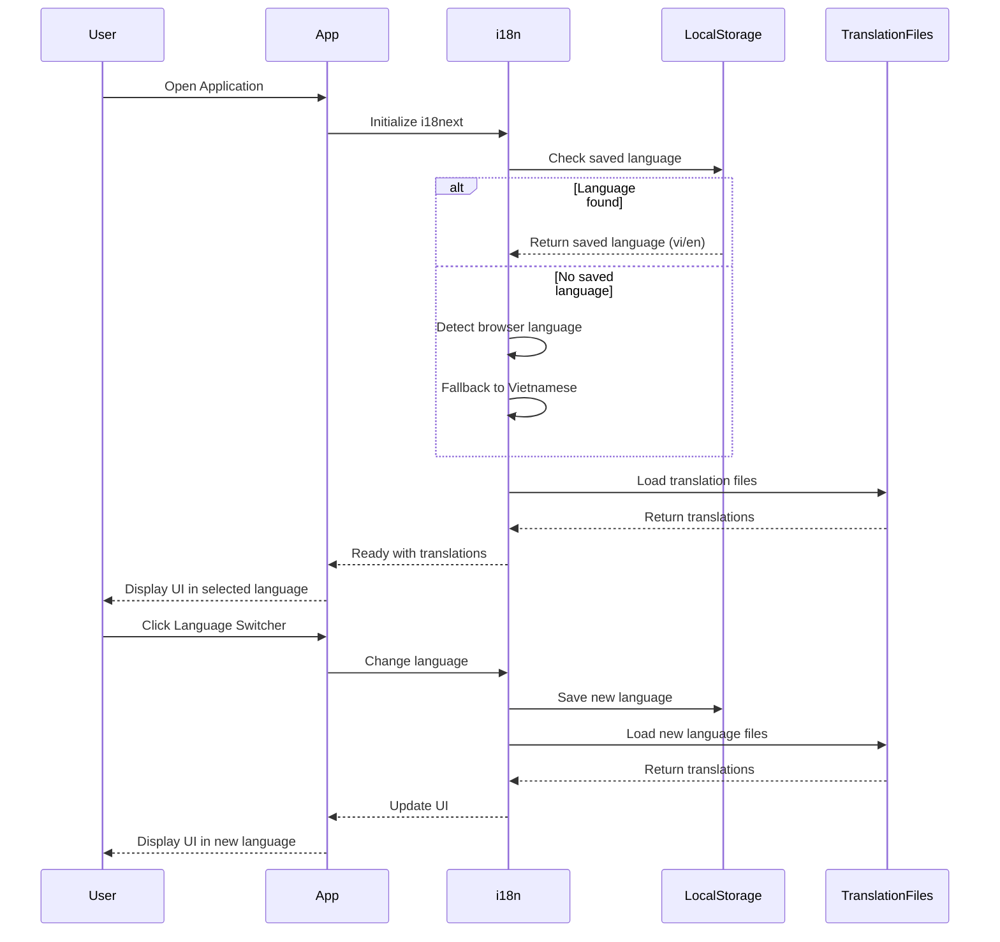

# Design Document: i18n-support (Internationalization Support)

## Overview

This design document outlines the comprehensive implementation plan for adding English language support to the Y99 HR management application. The application is currently entirely in Vietnamese, and this feature will enable bilingual support (Vietnamese/English) across all admin panels (11 tabs), employee views, and system notifications. The implementation will use react-i18next for robust internationalization with minimal performance impact (~15KB gzipped), following industry best practices for React applications.

The solution provides:
- Seamless language switching between Vietnamese and English
- Persistent language preference via LocalStorage
- Lazy-loaded translation files for optimal performance
- Type-safe translation keys with TypeScript
- Fallback mechanisms for missing translations
- Mobile-optimized with service worker caching

## Architecture




## Main Algorithm/Workflow



## Library Selection: react-i18next

**Chosen Library**: react-i18next (with i18next core)

**Rationale**:
- Industry standard for React i18n with 11M+ weekly downloads
- Lightweight (~15KB gzipped) with tree-shaking support
- Built-in React hooks (useTranslation) for functional components
- Supports namespace organization for large applications
- LocalStorage integration for language persistence
- TypeScript support with type-safe translations
- No additional build configuration needed with Vite
- Lazy loading support for translation files
- Compatible with existing React 19 and TypeScript setup

**Alternative Considered**: react-intl (rejected due to larger bundle size ~40KB and more complex API)


## Components and Interfaces

### 1. i18n Configuration Module

**Purpose**: Initialize and configure i18next with language detection and resource loading

**Location**: `src/i18n/config.ts`

```typescript
interface I18nConfig {
  defaultLanguage: 'vi' | 'en'
  supportedLanguages: Array<'vi' | 'en'>
  fallbackLanguage: 'vi'
  namespaces: string[]
  detection: {
    order: ['localStorage', 'navigator']
    caches: ['localStorage']
    lookupLocalStorage: 'i18nextLng'
  }
}
```

### 2. Language Context Provider

**Purpose**: Provide language state and switching functionality throughout the app

**Location**: `src/contexts/LanguageContext.tsx`

```typescript
interface LanguageContextType {
  language: 'vi' | 'en'
  setLanguage: (lang: 'vi' | 'en') => void
  t: (key: string, options?: object) => string
}

interface LanguageProviderProps {
  children: React.ReactNode
}
```

### 3. Language Switcher Component

**Purpose**: UI component for users to switch between Vietnamese and English

**Location**: `src/components/LanguageSwitcher.tsx`

```typescript
interface LanguageSwitcherProps {
  variant?: 'dropdown' | 'toggle' | 'compact'
  className?: string
}
```

### 4. Translation Hook

**Purpose**: Custom hook wrapping useTranslation with namespace support

**Location**: `src/hooks/useI18n.ts`

```typescript
interface UseI18nReturn {
  t: (key: string, options?: object) => string
  language: 'vi' | 'en'
  changeLanguage: (lang: 'vi' | 'en') => Promise<void>
  ready: boolean
}

function useI18n(namespace?: string): UseI18nReturn
```


## Data Models

### Translation File Structure

```typescript
// src/i18n/locales/vi/common.json
interface CommonTranslations {
  app: {
    name: string
    title: string
    subtitle: string
  }
  actions: {
    save: string
    cancel: string
    delete: string
    edit: string
    confirm: string
    close: string
    reload: string
    loading: string
  }
  time: {
    today: string
    yesterday: string
    week: string
    month: string
    year: string
  }
}
```

### Translation Namespace Organization

```typescript
// Namespace structure for organized translations
type TranslationNamespaces = 
  | 'common'           // Shared UI elements, buttons, actions
  | 'admin'            // Admin panel specific
  | 'attendance'       // Attendance/check-in module
  | 'shifts'           // Shift management
  | 'payroll'          // Payroll module
  | 'reports'          // Reports and statistics
  | 'departments'      // Department management
  | 'holidays'         // Holiday management
  | 'config'           // System configuration
  | 'notifications'    // Notification messages
  | 'export'           // Data export/import
  | 'settings'         // System settings
  | 'dashboard'        // Employee dashboard
  | 'profile'          // User profile
  | 'errors'           // Error messages
  | 'validation'       // Form validation messages
```


## Folder Structure

```
src/
├── i18n/
│   ├── config.ts                    # i18next configuration
│   ├── index.ts                     # Export i18n instance
│   └── locales/
│       ├── vi/                      # Vietnamese translations
│       │   ├── common.json
│       │   ├── admin.json
│       │   ├── attendance.json
│       │   ├── shifts.json
│       │   ├── payroll.json
│       │   ├── reports.json
│       │   ├── departments.json
│       │   ├── holidays.json
│       │   ├── config.json
│       │   ├── notifications.json
│       │   ├── export.json
│       │   ├── settings.json
│       │   ├── dashboard.json
│       │   ├── profile.json
│       │   ├── errors.json
│       │   └── validation.json
│       └── en/                      # English translations
│           ├── common.json
│           ├── admin.json
│           ├── attendance.json
│           ├── shifts.json
│           ├── payroll.json
│           ├── reports.json
│           ├── departments.json
│           ├── holidays.json
│           ├── config.json
│           ├── notifications.json
│           ├── export.json
│           ├── settings.json
│           ├── dashboard.json
│           ├── profile.json
│           ├── errors.json
│           └── validation.json
├── contexts/
│   └── LanguageContext.tsx          # Language context provider
├── hooks/
│   └── useI18n.ts                   # Custom i18n hook
└── components/
    └── LanguageSwitcher.tsx         # Language switcher UI
```


## Key Functions with Formal Specifications

### Function 1: initializeI18n()

```typescript
function initializeI18n(): Promise<void>
```

**Preconditions:**
- i18next library is installed and imported
- Translation files exist in `src/i18n/locales/` directory
- LocalStorage is available in browser

**Postconditions:**
- i18next instance is initialized and ready
- Default or saved language is loaded
- Translation resources are available
- Language detection is configured

**Loop Invariants:** N/A (no loops in initialization)

### Function 2: changeLanguage()

```typescript
function changeLanguage(language: 'vi' | 'en'): Promise<void>
```

**Preconditions:**
- i18next is initialized
- `language` parameter is either 'vi' or 'en'
- Translation files for target language exist

**Postconditions:**
- Active language is changed to target language
- New language is saved to LocalStorage
- UI re-renders with new translations
- Returns resolved promise on success

**Loop Invariants:** N/A (no loops)

### Function 3: translateText()

```typescript
function translateText(key: string, options?: TranslationOptions): string
```

**Preconditions:**
- i18next is initialized and ready
- Translation key follows namespace:key format (e.g., 'common:actions.save')

**Postconditions:**
- Returns translated string in current language
- If key not found, returns key itself (fallback behavior)
- Interpolation variables are replaced if provided in options
- Pluralization is applied if count is provided

**Loop Invariants:** N/A (no loops)


## Algorithmic Pseudocode

### Main Initialization Algorithm

```pascal
ALGORITHM initializeI18nSystem
INPUT: none
OUTPUT: initialized i18n instance

BEGIN
  // Step 1: Import i18next and plugins
  IMPORT i18next, i18nextReact, i18nextBrowserLanguageDetector
  
  // Step 2: Configure i18next
  config ← {
    defaultLanguage: 'vi',
    supportedLanguages: ['vi', 'en'],
    fallbackLanguage: 'vi',
    detection: {
      order: ['localStorage', 'navigator'],
      caches: ['localStorage'],
      lookupLocalStorage: 'i18nextLng'
    }
  }
  
  // Step 3: Load translation resources
  resources ← {}
  FOR EACH language IN config.supportedLanguages DO
    resources[language] ← {}
    FOR EACH namespace IN namespaceList DO
      filePath ← `locales/${language}/${namespace}.json`
      resources[language][namespace] ← LOAD_JSON(filePath)
    END FOR
  END FOR
  
  // Step 4: Initialize i18next
  i18next
    .use(i18nextBrowserLanguageDetector)
    .use(i18nextReact)
    .init({
      resources: resources,
      lng: config.defaultLanguage,
      fallbackLng: config.fallbackLanguage,
      supportedLngs: config.supportedLanguages,
      detection: config.detection,
      interpolation: {
        escapeValue: false
      }
    })
  
  RETURN i18next instance
END
```

**Preconditions:**
- All translation JSON files exist in correct directory structure
- i18next packages are installed via npm

**Postconditions:**
- i18next is fully initialized and ready for use
- Language detection is active
- All translation resources are loaded

**Loop Invariants:**
- For resource loading loop: All previously loaded namespaces are valid JSON
- For language loop: All previously loaded languages have complete namespace sets


### Language Switching Algorithm

```pascal
ALGORITHM switchLanguage
INPUT: targetLanguage of type ('vi' | 'en')
OUTPUT: success status of type boolean

BEGIN
  ASSERT targetLanguage IN ['vi', 'en']
  
  // Step 1: Validate target language
  IF targetLanguage NOT IN supportedLanguages THEN
    THROW Error("Unsupported language")
  END IF
  
  // Step 2: Check if already in target language
  currentLanguage ← i18next.language
  IF currentLanguage = targetLanguage THEN
    RETURN true
  END IF
  
  // Step 3: Change language in i18next
  TRY
    AWAIT i18next.changeLanguage(targetLanguage)
  CATCH error
    CONSOLE.ERROR("Failed to change language:", error)
    RETURN false
  END TRY
  
  // Step 4: Save to LocalStorage
  localStorage.setItem('i18nextLng', targetLanguage)
  
  // Step 5: Trigger UI re-render (handled by React context)
  notifyLanguageChange(targetLanguage)
  
  RETURN true
END
```

**Preconditions:**
- i18next is initialized
- targetLanguage is valid ('vi' or 'en')
- Translation files for target language are loaded

**Postconditions:**
- Active language is changed to targetLanguage
- LocalStorage contains new language preference
- All components using translations re-render with new language
- Returns true on success, false on failure

**Loop Invariants:** N/A (no loops)


## Example Usage

### Example 1: Basic Component Translation

```typescript
// Before: Hardcoded Vietnamese
const Dashboard: React.FC = () => {
  return (
    <div>
      <h1>Bảng điều khiển</h1>
      <button>Chấm công</button>
      <p>Chào mừng bạn đến với hệ thống</p>
    </div>
  );
};

// After: Using i18n
import { useI18n } from '../hooks/useI18n';

const Dashboard: React.FC = () => {
  const { t } = useI18n('dashboard');
  
  return (
    <div>
      <h1>{t('title')}</h1>
      <button>{t('checkInButton')}</button>
      <p>{t('welcomeMessage')}</p>
    </div>
  );
};

// Translation files:
// vi/dashboard.json
{
  "title": "Bảng điều khiển",
  "checkInButton": "Chấm công",
  "welcomeMessage": "Chào mừng bạn đến với hệ thống"
}

// en/dashboard.json
{
  "title": "Dashboard",
  "checkInButton": "Check In",
  "welcomeMessage": "Welcome to the system"
}
```

### Example 2: Admin Panel Tab Labels

```typescript
// Before: Hardcoded in AdminPanel.tsx
const tabs = [
  { id: 'USERS', label: 'Nhân viên', icon: <UserIcon /> },
  { id: 'ATTENDANCE', label: 'Chấm công', icon: <ClockIcon /> },
];

// After: Using i18n
import { useI18n } from '../hooks/useI18n';

const AdminPanel: React.FC = () => {
  const { t } = useI18n('admin');
  
  const tabs = [
    { id: 'USERS', label: t('tabs.users'), icon: <UserIcon /> },
    { id: 'ATTENDANCE', label: t('tabs.attendance'), icon: <ClockIcon /> },
    { id: 'SHIFT', label: t('tabs.shift'), icon: <CalendarIcon /> },
    { id: 'PAYROLL', label: t('tabs.payroll'), icon: <MoneyIcon /> },
    { id: 'REPORTS', label: t('tabs.reports'), icon: <ChartIcon /> },
  ];
  
  return (
    <div>
      {tabs.map(tab => (
        <button key={tab.id}>{tab.label}</button>
      ))}
    </div>
  );
};

// Translation files:
// vi/admin.json
{
  "tabs": {
    "users": "Nhân viên",
    "attendance": "Chấm công",
    "shift": "Đăng ký ca",
    "payroll": "Bảng lương",
    "reports": "Thống kê",
    "departments": "Phòng ban",
    "holidays": "Ngày lễ",
    "config": "Cấu hình",
    "notifications": "Thông báo",
    "export": "Xuất/Nhập",
    "settings": "Hệ thống"
  }
}

// en/admin.json
{
  "tabs": {
    "users": "Employees",
    "attendance": "Attendance",
    "shift": "Shift Registration",
    "payroll": "Payroll",
    "reports": "Reports",
    "departments": "Departments",
    "holidays": "Holidays",
    "config": "Configuration",
    "notifications": "Notifications",
    "export": "Export/Import",
    "settings": "System Settings"
  }
}
```


### Example 3: Language Switcher Component

```typescript
import React from 'react';
import { useI18n } from '../hooks/useI18n';

const LanguageSwitcher: React.FC = () => {
  const { language, changeLanguage } = useI18n();
  
  return (
    <div className="flex items-center gap-2">
      <button
        onClick={() => changeLanguage('vi')}
        className={`px-3 py-1 rounded ${
          language === 'vi' ? 'bg-blue-600 text-white' : 'bg-gray-200'
        }`}
      >
        Tiếng Việt
      </button>
      <button
        onClick={() => changeLanguage('en')}
        className={`px-3 py-1 rounded ${
          language === 'en' ? 'bg-blue-600 text-white' : 'bg-gray-200'
        }`}
      >
        English
      </button>
    </div>
  );
};

export default LanguageSwitcher;
```

### Example 4: Translation with Interpolation

```typescript
import { useI18n } from '../hooks/useI18n';

const AttendanceRecord: React.FC<{ userName: string; hours: number }> = ({ userName, hours }) => {
  const { t } = useI18n('attendance');
  
  return (
    <div>
      <p>{t('recordMessage', { name: userName, hours })}</p>
      <p>{t('hoursWorked', { count: hours })}</p>
    </div>
  );
};

// Translation files:
// vi/attendance.json
{
  "recordMessage": "{{name}} đã làm việc {{hours}} giờ",
  "hoursWorked": "{{count}} giờ làm việc",
  "hoursWorked_plural": "{{count}} giờ làm việc"
}

// en/attendance.json
{
  "recordMessage": "{{name}} worked {{hours}} hours",
  "hoursWorked": "{{count}} hour worked",
  "hoursWorked_plural": "{{count}} hours worked"
}
```


## Correctness Properties

### Property 1: Language Persistence
```typescript
// Universal quantification: Language preference persists across sessions
∀ user, session₁, session₂: 
  (user.selectLanguage(lang) in session₁) ⟹ 
  (user.currentLanguage = lang in session₂)

// Test assertion
assert(localStorage.getItem('i18nextLng') === selectedLanguage);
```

### Property 2: Translation Completeness
```typescript
// Universal quantification: All keys exist in both languages
∀ namespace, key: 
  (key ∈ translations.vi[namespace]) ⟹ 
  (key ∈ translations.en[namespace])

// Test assertion
const viKeys = Object.keys(viTranslations);
const enKeys = Object.keys(enTranslations);
assert(viKeys.length === enKeys.length);
assert(viKeys.every(key => enKeys.includes(key)));
```

### Property 3: Fallback Behavior
```typescript
// Universal quantification: Missing translations fall back gracefully
∀ key: 
  (key ∉ translations[currentLang]) ⟹ 
  (t(key) = translations.vi[key] || key)

// Test assertion
const result = t('nonexistent.key');
assert(result === 'nonexistent.key' || result === viTranslations['nonexistent.key']);
```

### Property 4: UI Reactivity
```typescript
// Universal quantification: Language change triggers UI update
∀ component: 
  (changeLanguage(newLang)) ⟹ 
  (component.renders with translations[newLang])

// Test assertion
changeLanguage('en');
await waitFor(() => {
  expect(screen.getByText(enTranslations.key)).toBeInTheDocument();
});
```

### Property 5: No Runtime Errors
```typescript
// Universal quantification: Translation function never throws
∀ key, options: 
  (t(key, options)) does not throw Error

// Test assertion
expect(() => t('any.key', { param: 'value' })).not.toThrow();
```


## Error Handling

### Error Scenario 1: Missing Translation Key

**Condition**: Translation key does not exist in current language file

**Response**: 
- Return the key itself as fallback text
- Log warning to console in development mode
- Do not crash the application

**Recovery**: 
- Display key as text (e.g., "common:actions.save")
- Allow user to continue using the app
- Developer can identify missing keys from console warnings

### Error Scenario 2: Failed to Load Translation Files

**Condition**: Network error or missing translation file during initialization

**Response**:
- Use fallback language (Vietnamese) translations
- Display error notification to user
- Retry loading after 5 seconds

**Recovery**:
- App continues to function with fallback language
- Automatic retry mechanism attempts to reload files
- User can manually trigger reload via refresh button

### Error Scenario 3: Invalid Language Code

**Condition**: User attempts to switch to unsupported language

**Response**:
- Reject language change request
- Display error message: "Language not supported"
- Keep current language active

**Recovery**:
- User remains on current language
- No state change occurs
- Error message disappears after 3 seconds

### Error Scenario 4: LocalStorage Unavailable

**Condition**: Browser has LocalStorage disabled or in private mode

**Response**:
- Use in-memory storage for language preference
- Detect browser language on each session
- Display warning about language preference not persisting

**Recovery**:
- App functions normally with session-only language preference
- User can still switch languages within session
- Language resets to browser default on page reload


## Testing Strategy

### Unit Testing Approach

**Test Framework**: Vitest (already compatible with Vite setup)

**Key Test Cases**:

1. i18n Initialization
   - Verify i18next initializes with correct configuration
   - Check default language is Vietnamese
   - Ensure all namespaces are loaded

2. Translation Function
   - Test basic translation retrieval
   - Test interpolation with variables
   - Test pluralization rules
   - Test missing key fallback behavior

3. Language Switching
   - Test switching from Vietnamese to English
   - Test switching from English to Vietnamese
   - Verify LocalStorage is updated
   - Verify UI re-renders with new language

4. Language Detection
   - Test browser language detection
   - Test LocalStorage preference priority
   - Test fallback to Vietnamese

### Integration Testing Approach

**Test Framework**: Vitest + React Testing Library

**Key Integration Tests**:

1. Component Translation
   - Render component with Vietnamese translations
   - Switch language and verify English translations appear
   - Test all admin panel tabs display correct labels

2. Language Switcher Component
   - Click Vietnamese button and verify language changes
   - Click English button and verify language changes
   - Verify active state styling updates

3. Full User Flow
   - User opens app → sees Vietnamese (default)
   - User clicks language switcher → switches to English
   - User refreshes page → still sees English (persistence)
   - User switches back to Vietnamese → sees Vietnamese

### Property-Based Testing Approach

**Test Library**: fast-check (JavaScript property-based testing)

**Properties to Test**:

1. Translation Symmetry
   - Property: Switching language twice returns to original translations
   - Generator: Random language sequences

2. Key Consistency
   - Property: All Vietnamese keys have corresponding English keys
   - Generator: Random namespace and key combinations

3. Interpolation Safety
   - Property: Translation with any interpolation values never throws
   - Generator: Random objects with various data types


## Performance Considerations

### Bundle Size Optimization

**Strategy**: Lazy load translation files per namespace

**Expected Impact**:
- Initial bundle: +15KB (i18next core + common translations)
- Per-namespace: +2-5KB (loaded on demand)
- Total overhead: ~30KB for full app (vs ~100KB if all loaded upfront)

**Implementation**:
```typescript
// Load translations on-demand instead of all at once
i18next.use(Backend).init({
  backend: {
    loadPath: '/locales/{{lng}}/{{ns}}.json',
  },
  ns: ['common'], // Load only common namespace initially
  defaultNS: 'common',
  fallbackNS: 'common',
});

// Load additional namespaces when needed
const AdminPanel = () => {
  const { t } = useTranslation(['common', 'admin']); // Loads admin namespace
  // ...
};
```

### Runtime Performance

**Optimization 1**: Memoize translation function calls
```typescript
const MemoizedComponent = React.memo(({ data }) => {
  const { t } = useI18n('dashboard');
  
  // Translation is called only when language changes
  const title = useMemo(() => t('title'), [t]);
  
  return <h1>{title}</h1>;
});
```

**Optimization 2**: Use translation keys instead of full strings in state
```typescript
// Bad: Store translated strings in state
const [message, setMessage] = useState(t('welcome'));

// Good: Store translation keys in state
const [messageKey, setMessageKey] = useState('welcome');
const message = t(messageKey);
```

**Optimization 3**: Batch language changes
```typescript
// Prevent multiple re-renders during initialization
i18next.init({
  react: {
    bindI18n: 'languageChanged', // Only re-render on language change
    bindI18nStore: '', // Don't re-render on resource changes
    useSuspense: false,
  }
});
```


### Mobile Performance

**Consideration**: Mobile devices have slower networks and less memory

**Optimizations**:

1. Preload critical translations
   - Load common namespace immediately
   - Lazy load other namespaces on navigation

2. Compress translation files
   - Use gzip compression on server
   - Minify JSON files (remove whitespace)

3. Cache translations aggressively
   - Use service worker to cache translation files
   - Set long cache expiration (1 week)

4. Reduce re-renders
   - Use React.memo for translated components
   - Avoid inline translation calls in render loops

## Security Considerations

### XSS Prevention

**Risk**: User-provided content in translations could execute malicious scripts

**Mitigation**:
- i18next escapes HTML by default (interpolation.escapeValue: true)
- Never use dangerouslySetInnerHTML with translated content
- Sanitize any user-provided interpolation values

**Implementation**:
```typescript
// Safe: Escaped by default
<p>{t('message', { userName: userInput })}</p>

// Unsafe: Avoid this
<div dangerouslySetInnerHTML={{ __html: t('message') }} />
```

### Translation File Integrity

**Risk**: Malicious modification of translation files

**Mitigation**:
- Serve translation files from same origin
- Use Content Security Policy (CSP) headers
- Implement file integrity checks in production

## Dependencies

**Required npm Packages**:
```json
{
  "dependencies": {
    "i18next": "^23.7.0",
    "react-i18next": "^14.0.0",
    "i18next-browser-languagedetector": "^7.2.0"
  },
  "devDependencies": {
    "fast-check": "^3.15.0"
  }
}
```

**Installation Command**:
```bash
npm install i18next react-i18next i18next-browser-languagedetector
npm install --save-dev fast-check
```


## Implementation Phases

### Phase 1: Core Infrastructure (Priority: High)
- Install i18next packages
- Create i18n configuration file
- Set up translation file structure
- Create Language Context Provider
- Create useI18n custom hook
- Create Language Switcher component

### Phase 2: Common Translations (Priority: High)
- Extract common UI elements (buttons, actions, time labels)
- Create common.json for Vietnamese and English
- Update shared components to use translations

### Phase 3: Admin Panel (Priority: High)
- Extract all 11 admin tab labels
- Create admin.json translations
- Update AdminPanel component
- Add Language Switcher to admin header

### Phase 4: Employee Views (Priority: Medium)
- Extract Dashboard translations
- Extract CheckIn translations
- Extract Shift Registration translations
- Extract Payroll translations
- Create respective translation files

### Phase 5: Forms and Validation (Priority: Medium)
- Extract form labels and placeholders
- Extract validation error messages
- Create validation.json translations

### Phase 6: Notifications and Errors (Priority: Low)
- Extract notification messages
- Extract error messages
- Create notifications.json and errors.json

### Phase 7: Testing and QA (Priority: High)
- Write unit tests for i18n functions
- Write integration tests for components
- Write property-based tests
- Manual QA testing for all screens

### Phase 8: Documentation (Priority: Low)
- Create developer guide for adding new translations
- Document translation key naming conventions
- Create translation contribution guide


## Migration Strategy

### Automated Extraction Tool

Create a script to extract Vietnamese strings from components:

```typescript
// scripts/extract-translations.ts
import * as fs from 'fs';
import * as path from 'path';

interface TranslationEntry {
  key: string;
  vi: string;
  en: string;
  file: string;
  line: number;
}

function extractVietnameseStrings(filePath: string): TranslationEntry[] {
  const content = fs.readFileSync(filePath, 'utf-8');
  const entries: TranslationEntry[] = [];
  
  // Regex to match Vietnamese strings (contains Vietnamese characters)
  const vietnameseRegex = /['"]([^'"]*[\u00C0-\u1EF9]+[^'"]*)['"]/g;
  
  let match;
  while ((match = vietnameseRegex.exec(content)) !== null) {
    const vietnameseText = match[1];
    const key = generateKey(vietnameseText);
    
    entries.push({
      key,
      vi: vietnameseText,
      en: '', // To be filled by translator
      file: filePath,
      line: content.substring(0, match.index).split('\n').length
    });
  }
  
  return entries;
}

function generateKey(text: string): string {
  // Convert Vietnamese text to camelCase key
  return text
    .toLowerCase()
    .replace(/[àáạảãâầấậẩẫăằắặẳẵ]/g, 'a')
    .replace(/[èéẹẻẽêềếệểễ]/g, 'e')
    .replace(/[ìíịỉĩ]/g, 'i')
    .replace(/[òóọỏõôồốộổỗơờớợởỡ]/g, 'o')
    .replace(/[ùúụủũưừứựửữ]/g, 'u')
    .replace(/[ỳýỵỷỹ]/g, 'y')
    .replace(/đ/g, 'd')
    .replace(/[^a-z0-9]+/g, ' ')
    .trim()
    .split(' ')
    .map((word, index) => 
      index === 0 ? word : word.charAt(0).toUpperCase() + word.slice(1)
    )
    .join('');
}

// Usage
const componentFiles = [
  'components/AdminPanel.tsx',
  'components/Dashboard.tsx',
  'components/CheckIn.tsx',
  // ... more files
];

const allTranslations: Record<string, TranslationEntry[]> = {};

componentFiles.forEach(file => {
  const entries = extractVietnameseStrings(file);
  allTranslations[file] = entries;
});

// Output to JSON files
fs.writeFileSync(
  'translations-to-migrate.json',
  JSON.stringify(allTranslations, null, 2)
);
```

### Manual Migration Checklist

For each component:
1. ✓ Run extraction script to identify Vietnamese strings
2. ✓ Determine appropriate namespace for component
3. ✓ Create translation keys in JSON files
4. ✓ Add useI18n hook to component
5. ✓ Replace hardcoded strings with t() calls
6. ✓ Test component in both languages
7. ✓ Update component tests to handle i18n


## Translation Key Naming Conventions

### General Rules

1. Use camelCase for keys: `checkInButton`, `welcomeMessage`
2. Use dot notation for nesting: `tabs.users`, `actions.save`
3. Keep keys descriptive but concise
4. Group related translations under common parent keys
5. Use consistent naming across namespaces

### Examples

**Good**:
```json
{
  "tabs": {
    "users": "Nhân viên",
    "attendance": "Chấm công"
  },
  "actions": {
    "save": "Lưu",
    "cancel": "Hủy"
  }
}
```

**Bad**:
```json
{
  "tab_users": "Nhân viên",
  "tab_attendance": "Chấm công",
  "btn_save": "Lưu",
  "btn_cancel": "Hủy"
}
```

### Namespace Guidelines

- `common`: Shared across entire app (buttons, actions, time labels)
- `admin`: Admin panel specific (tab labels, admin actions)
- `attendance`: Attendance module specific
- `shifts`: Shift management specific
- `payroll`: Payroll module specific
- `dashboard`: Employee dashboard specific
- `errors`: Error messages
- `validation`: Form validation messages

## Language Switcher Placement

### Admin Panel
- Location: Top right header, next to user profile menu
- Style: Compact toggle or dropdown
- Visibility: Always visible

### Employee Views
- Location: Settings page or profile menu
- Style: Full button group
- Visibility: Accessible from main navigation

### Mobile Views
- Location: Hamburger menu or settings
- Style: List item with language options
- Visibility: In navigation drawer


## Bilingual Email Templates

### Extending Existing Email Implementation

The application already has bilingual email templates (Vietnamese/English) for shift change notifications. This pattern should be extended to all email notifications.

**Current Implementation Pattern** (from `send-shift-change-notification/index.ts`):
```typescript
const emailHtml = `
  <div class="header">
    <h1>⚠️ Yêu cầu đổi ca đã duyệt</h1>
    <p>Approved Shift Change Request</p>
  </div>
  <div class="content">
    <p><strong>Xin chào / Hello ${admin.name},</strong></p>
    <p>
      Nhân viên <strong>${employeeName}</strong> đã yêu cầu đổi lịch ca đã được duyệt.<br>
      <span style="color: #64748b;">
        Employee <strong>${employeeName}</strong> has requested to change an approved shift.
      </span>
    </p>
  </div>
`;
```

**Recommendation**: 
- Keep bilingual format in emails (both languages in same email)
- Do NOT use i18n for emails (emails are sent to users who may have different language preferences)
- Maintain current pattern: Vietnamese first, English second in gray text
- This ensures all recipients can read emails regardless of their app language setting

## Date and Time Localization

### Locale-Aware Formatting

Use JavaScript's built-in Intl API for date/time formatting:

```typescript
const { language } = useI18n();

// Date formatting
const date = new Date();
const formattedDate = date.toLocaleDateString(
  language === 'vi' ? 'vi-VN' : 'en-US',
  { weekday: 'long', day: 'numeric', month: 'long', year: 'numeric' }
);

// Time formatting
const formattedTime = date.toLocaleTimeString(
  language === 'vi' ? 'vi-VN' : 'en-US',
  { hour: '2-digit', minute: '2-digit' }
);

// Number formatting
const number = 1234567.89;
const formattedNumber = number.toLocaleString(
  language === 'vi' ? 'vi-VN' : 'en-US'
);
```

### Expected Output

**Vietnamese (vi-VN)**:
- Date: "Thứ Hai, 15 tháng 1, 2024"
- Time: "14:30"
- Number: "1.234.567,89"

**English (en-US)**:
- Date: "Monday, January 15, 2024"
- Time: "2:30 PM"
- Number: "1,234,567.89"


## Success Metrics

### Technical Metrics

1. **Bundle Size Impact**
   - Target: < 20KB increase in initial bundle
   - Measure: Lighthouse performance score remains > 90

2. **Translation Coverage**
   - Target: 100% of UI text translated
   - Measure: No hardcoded Vietnamese strings in components

3. **Performance Impact**
   - Target: < 50ms overhead for language switching
   - Measure: React DevTools Profiler

4. **Test Coverage**
   - Target: > 80% code coverage for i18n functions
   - Measure: Vitest coverage report

### User Experience Metrics

1. **Language Persistence**
   - Target: 100% of language preferences persist across sessions
   - Measure: User testing and analytics

2. **Translation Quality**
   - Target: 0 reported translation errors after 1 week
   - Measure: User feedback and bug reports

3. **Adoption Rate**
   - Target: > 20% of users switch to English within 1 month
   - Measure: Analytics tracking language preference

## Rollout Plan

### Phase 1: Internal Testing (Week 1)
- Deploy to staging environment
- Internal team testing
- Fix critical bugs

### Phase 2: Beta Testing (Week 2)
- Deploy to production with feature flag
- Enable for 10% of users
- Monitor for issues

### Phase 3: Gradual Rollout (Week 3)
- Increase to 50% of users
- Monitor performance metrics
- Gather user feedback

### Phase 4: Full Release (Week 4)
- Enable for 100% of users
- Announce feature to all users
- Monitor adoption metrics

